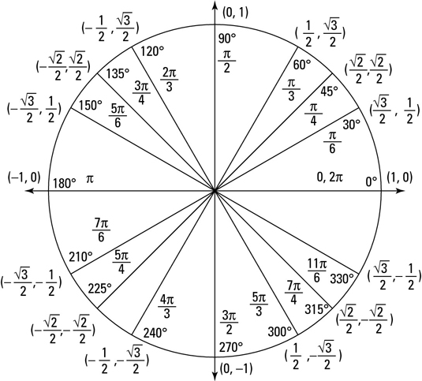
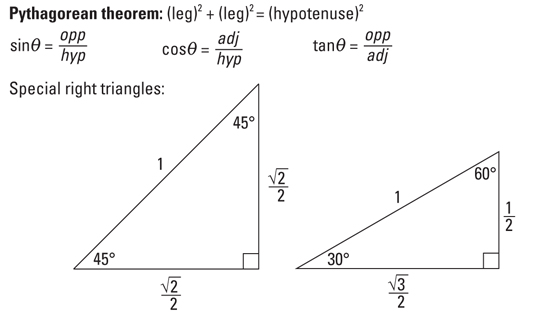
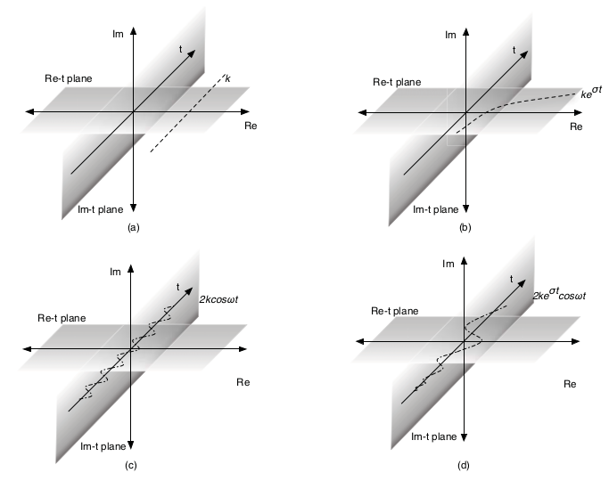
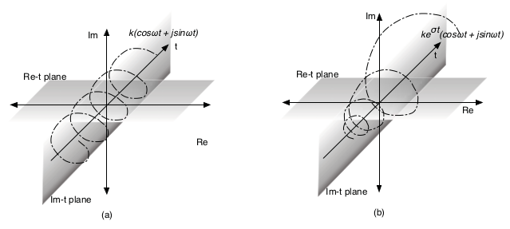
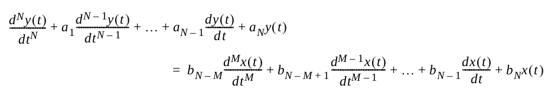
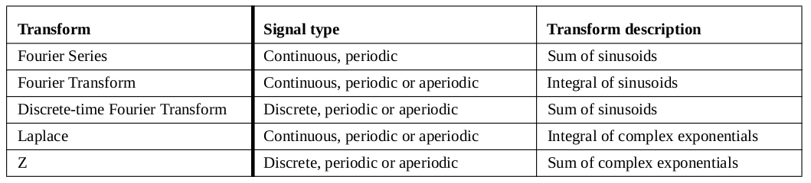

# Signals, Systems and Transforms

**Signal** : Series of numbers/vectors or continuous function of time with different characteristics (discrete/continuous, digital/analog, periodic/aperiodic, time-limited/unlimited, time-shifted, time-scaled)

**System** : Process that converts input signals to output signals (it is a function whose domains and ranges are both set of functions)

**Transform** : Changes the Basis of a signal. In Computer Networking,
the basis of sinusoids are what we care about.

**Sinusoid** : Carrier signal associated with a time period T such that, at time t, the amplitude of the signal is defined by **cos(2.PI.t/T)**

What is interesting about Sinusoid is that it can by modelized by a vector (phasor) on a disk of radius 1 that rotates at constant angular velocity w (little omega) with a period of T seconds.

w = 2.PI / T -> THETA = 2.PI.t/T = wt  (THETA being the phase angle made by the phasor and the x axis in radians (2PI radians = 360degrees))

## Complex numbers

- i can be seen as the 90-degree rotation operator of a vector. 
- j^2 = -1 (the vector (0,0)(0,1) rotated 2 times) ->  j = SQRT(-1)
- Thus, we can draw a plane with reals as x axis and imaginaries as y axis. 
- Any vector on this plane can be represented as the vector sum a + ib (or a + jb)
- z = a+ib is a complex number; a = Re(z); b = Im(z); zSTAR = a-ib (z * is the complex conjugate)

## Euler's formula

The phasor is "conveniently" represented by **ce^(iTHETA) = c(cos(THETA) + isin(THETA))** (c being the magnitude of the vector)

a + ib = c.cos(THETA) + c.i.sin(THETA) => a = c.cos(THETA) ; b = c.sin(THETA)
; c = SQRT(a^2 + b^2) ; THETA = arctan(b/a)

Also cos(THETA) = 1/2 (e^(iTHETA) + e^(-iTHETA)) and sin(THETA) = 1/2i (e^(iTHETA) - e^(-iTHETA))

## Convolution (that is really convoluted...)

DELTA (or Impulse) function is used to "select" part of a function (for continuous functions, delta is the special DIRAC-DELTA) by being 1 where we want to select and 0 otherwise 

## Discrete functions

x(t) (×) y(t) = SUM(x(TO)y(t-TO)) for TO = -INF to +INF

(the symbol (×) replace the real symbol * since it is now wrongly seen as a simple multiplication)

## Continuous functions

x(t) (×) y(t) = INTEGRAL(x(TO)y(t-TO))dTO for TO = -INF to +INF

## The complex exponential signal

ke^(st) where s = SIGMA + iOMEGA 

Expanding it gives : ke^(SIGMA.t) * cos(OMEGA.t) + ike^(SIGMA.t) * sin(OMEGA.t)

This signal is interesting because it can represents a variety of signals, for example : 
- s=0 -> we get the constant signal k
- OMEGA=0 -> real monotone exponentiel signal ke^(SIGMA.t)
- s = +/- iOMEGA -> sinusoids
- SIGMA = 0 -> helix (whose projections are sinusoids)
- Finally, exponentially modulated helix (whose projections are exponentially modulated sinusoids)

Helixes : 

(®mfcn)

## Types of Systems

- Causal systems : Act only on inputs from the past (funnily, **a**causal DO exist !) 
- Memoryless : Act only on the inputs presented at a point in time
- Dynamic : Depend both on current and past inputs
- Time-invariant : Parameters do not change with time
- Additive : y1+y2 = H(x1+x2)
- Homogeneous/scaling : ky = H(kx)
- Superposition : Both additive and homogenous that is k1y1 + k2y2 = H(k1x1 + k2x2)
- Linear System : Must have the properties Additive & Homogeneous (or Superposition)

## Analysis of the output of an LTI (Linear time-invariant) System 

General linear differential equation that can describe a (lot of) LTI system : 

### On a complex exponential input

Considering an LTI system y(t) = H(x(t)) with a complex exp input x(t) = ke^(st)

The ouput end up being y(t) = f(s).e^(st) where f(s) is an arbitrary function independent of t.

It means that for ANY LTI system, if the input is a complex exp, the output is
too (without even knowing what's inside the LTI black box).

But wait, there is more : For this particular input, the LTI acts as a scalar
multiplier so x(t) = ke^(st) is an **eigenfunction**. The corresponding
eigenvalue is the multiplier factor f(s).

-> If an input can be represented as a sum of such eigenfunctions, the output
will simply be the sum of the scaled inputs.

### Zero Input (except the initial impulse)

Starting with the general form, setting the right hand side to zero and
replacing d^N/dt^N by D^N, we get : 

(D^N + a1D^(N-1) + ... + aN-1.D + aN)y(t) = 0 -> D is the **characteristic
polynomial** of the system

The output end up being y(t) = SUM(ci.e^(LAMBDAi.t)) for i=1 to N   (LAMBDAi
being a root of the polynomial and corresponds to a **natural frequency** of
the LTI system). The solution of the equation is the **natural response** of
the system. This solution assumes that the roots of the polynomial are distinct.

(This is a basis of radio reception : if an input with a frequency equal to one of the natural
frequencies, the system will **resonate**, amplifying the input)

If the roots of the characteristic polynomial are distinct, the output becomes :  y(t) = c1.e^(LAMBDA.t) + c2.t.e^(LAMBDA.t) + ... + cr.t^(r-1).e^(LAMBDA.t)

### Arbitrary input

Input : x(t) = INTEGRAL(x(TO)DELTA(t-TO)dTO) from -INF and +INF 

Output : x(t) (×) h(t) = INTEGRAL(x(TO)h(t-TO)dTO) from -INF to +INF

h(t) being the impulse response and DELTA(t) the DIRAC-DELTA

This means that for any input, knowing the impulse response gives the possibility to compute the total response of the system.

### Stability

An LTI system is **asymptotically stable** if ALL its roots have a value of SIGMA < 0.

It is **purely oscillatory** (or **marginally stable**) if all the values of SIGMA = 0 and there are no repeated roots.

Otherwise the system is **unstable**.

## Transforms

Main usage of transforms : 
- Easier computation of the convolution
- Simplify linear differential equations (convert to another "simpler" equation)
- Gives insight into the natural response of a system

Some interesting transforms : 

### Fourier series

ANY periodic function can be represented as the sum of sinusoids:

x(t) = a0 + SUM(ak.cos(k.OMEGA0.t) + bk.sin(k.OMEGA0.t)) for k = 1 to +INF; OMEGA0 being the **fundamental angular frequency** 2.PI/T0

(and here come the harmonics!)

a0 = 1/T0 INTEGRAL(x(t)dt) from 0 to T0  is the DC component. 

x(t) = SUM(ck.e^(jk.OMEGA0.t)) for k = -INF to +INF

"c" term is defined by : c0 = a0, ck = 1/2(ak - jbk), c-k = 1/2(ak + jbk) and more generally : ck = 1/T0 INTEGRAL(x(t)e^(-jk.OMEGA0.t)dt) from 0 to T0

Note: sin(x)/x is called the **sinc** function (which value is 1 at 0 ! And is a symetric function that sinusoidally tends to 0 ( yeah, this definition is totally made up ;-) ) )

### Fourier Transform

Series can't represent **a**periodic functions, so came the Fourier Transform.

To transform of a signal x(t) to a function of the complex quantity jOMEGA : X(jOMEGA) = INTEGRA(x(t).e^(-j.OMEGA.t)dt) from -INF to +INF

To validate the existence of a Fourier transform, we have to validate the (sufficient) **Dirichlet conditions** : 
- the signal x(t) must be **absolutely integrable** (the integration is finite) 
- x(t) has (in any finite interval) :
  - a finite number of maxima
  - a finite number of minima
  - a finite number of discontinuities

To recover a signal from a transform : x(t) = 1/2PI.INTEGRAL(X(jOMEGA)e^(j.OMEGA.t)dOMEGA) from -INF to +INF

Some properties of Fourier transforms : 
- Linearity (addition/scaling of a function results in the addition/scaling of the transform)
- Time-shifting (but not as simply) : x(t) <-> X(jOMEGA) becomes x1(t-t0) <-> e^(-j.OMEGA.t0)X1(jOMEGA)
- Time-scaling : x(t) <-> X(jOMEGA) becomes x(at) <-> 1/|a|.X(jOMEGA/a)
- Duality (new transforms can be computed from a transform)
- Differentiation: x(t) <-> X(jOMEGA) becomes dx^n(t)/dt^n <-> (jOMEGA)^n.X(jOMEGA)
- Convolution: 
  - convolution of functions corresponds to multiplication of the transforms of those functions
  - multiplication of functions corresponds to convultion of the transforms (multiplied by 1/2PI)

### Laplace Transform

When Dirichlet conditions are not satisfied, Laplace comes handy. The **region
of convergence** (the values of SIGMA) must still be specified though. Also,
the Lplace transform is generally a complex function.

X(s) = INTEGRAL(x(t)e^(-st)dt) from -INF to +INF (s = SIGMA + jOMEGA)

The inverse : x(t) = 1/(2.PI.j). INTEGRAL(X(s)e^(st)ds) from (SIGMA - jINF) to (SIGMA + jINF)

Poles : Values for which the transform goes to INF

Zeroes: Values of s for which the thansform = 0

The properties of Laplace transform (see the tables) have the same properties as Fourier
transform, plus : 
- Integration which correponds to a division by a complex factor in the transform domain
- Final value theorem : The limit of a function when t tends to +INF corresponds to the limit of sX(s) when s tends to 0.

### Discrete-time Fourier Transform

x[nT] <-> SUM(x[nT].e^(-jOMEGA.nT)) for n = -INF to +INF

and its inverse : x[nT] = 1/OMEGAs.INTEGRAL(X(jOMEGA)e^(jOMEGA.nT)dOMEGA) from 0 to OMEGAs  (OMEGAs = 2PI/T)

### Aliasing

Two non-identical signals whose sampled versions are identical are said to be aliases of each other.

Nyquist criterion : to prevent aliasing, the sampling function should have a frequency that is at least twice that of the highest frequency component of a signal

### The Z Transform

Generalizes the Discrete-Time-and-Frequency-Fourier-Transform (DFT) (where the latter can be computed by the Fast-Fourier-Transform (FFT)) in the same way the Laplace Transform generalizes the Fourier Transform.

"The integral in the Fourier transform can be viewed as the limiting sum of a series of unmodulated complex exponentials as their inter-frequency separation tends to zero, The Laplace transform generalizes this by taking the limiting sum over a series of modulated complex exponentials. In the same way, the DFT is a finite sum of unmodulated complex exponentials. The Z transform generalizes this to an infinite sum of modulated complex exponentials"

x[k] <-> X(z) = SUM(x[k]z^-k) for k=0 to INF (as in Laplace, the region of convergence is important)

Inverse Z transform :  x[k] = 1/2PIj. INTEGRAL(X(z)z^(k-1)dz) for C range (C being the circle where are the poles of z reside)

(see tables for properties & common transforms)

